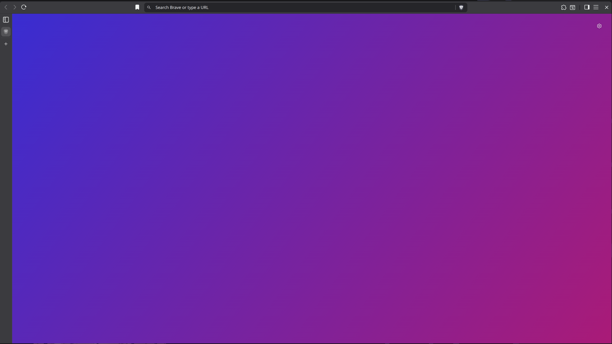

# dotbrave

[](https://github.com/xom11/dotbrave/actions/workflows/ci.yml)
[](https://pypi.org/project/dotbrave/)
[](https://pypi.org/project/dotbrave/)

Manage Brave as a dotfile. Keep keyboard shortcuts, UI tweaks, and
force-installed web apps in a single TOML, apply with one command, sync
across machines — no Brave Sync required.

> **Status: alpha.** Works on Linux, macOS, and Windows against Brave
> stable, beta, and nightly. Extracted from the multi-browser
> [dotbrowser](https://github.com/xom11/dotbrowser) project as a focused,
> Brave-only tool with a flatter CLI (`dotbrave apply` instead of
> `dotbrowser brave apply`). Python 3.11+, standard library only.

## Quick start

The repo ships an opinionated example config: vertical tabs collapsed to
icons, decluttered new tab page, stripped-down toolbar, vim-style hjkl
shortcuts. [`examples/all.toml`](examples/all.toml) bundles all three
namespaces; [`shortcuts.toml`](examples/shortcuts.toml),
[`settings.toml`](examples/settings.toml), and
[`pwa.toml`](examples/pwa.toml) are single-namespace variants.



**Scaffold a starter config from scratch:**

```bash
dotbrave init                # write commented template to stdout
dotbrave init -o brave.toml  # ...or to a file
```

**Or apply the example directly from GitHub** — no clone, no install.
Fetched payloads are echoed with byte size + SHA-256 so you can see exactly
what's being applied:

```bash
uvx dotbrave apply --dry-run \
  https://raw.githubusercontent.com/xom11/dotbrave/main/examples/all.toml

# Apply. If Brave is already running, dotbrave uses live apply;
# first-time live setup closes Brave normally and relaunches it once.
uvx dotbrave apply \
  https://raw.githubusercontent.com/xom11/dotbrave/main/examples/all.toml
```

Prefer to inspect / customise locally first? Download then apply:

```bash
curl -fsSL -o brave.toml https://raw.githubusercontent.com/xom11/dotbrave/main/examples/all.toml
# edit brave.toml ...
uvx dotbrave apply brave.toml
```

Anything you later remove from your config reverts to Brave's default on
the next `apply` — no orphan entries.

## Install

```bash
pipx install dotbrave     # global, isolated venv
uvx dotbrave <args>       # run on demand, no install step
pip install dotbrave      # into the active environment
```

Run from a branch: `uvx --from git+https://github.com/xom11/dotbrave dotbrave <args>`.
Local dev: `pip install -e ".[test]"`. Nix users: the repo ships a flake
(`nix run github:xom11/dotbrave`).

## Build your own config

A single TOML carries `[shortcuts]`, `[settings]` and `[pwa]`. One `apply`
writes all three in a single backup + write cycle.

```toml
# brave.toml
[shortcuts]
toggle_sidebar = ["Control+Shift+KeyE"]
toggle_ai_chat = ["Alt+KeyA"]

# vim-style hjkl
back                = ["Alt+KeyH"]
forward             = ["Alt+KeyL"]
select_previous_tab = ["Alt+KeyJ"]
select_next_tab     = ["Alt+KeyK"]

# Same chord on all OSes — Meta+ = Cmd on macOS, Super on Linux/Windows (auto-translated)
new_tab   = ["Control+KeyT", "Meta+KeyT"]
close_tab = ["Control+KeyW", "Meta+KeyW"]

[settings]
"brave.tabs.vertical_tabs_enabled"   = true
"brave.tabs.vertical_tabs_collapsed" = true
"bookmark_bar.show_on_all_tabs"      = false

[pwa]
# Force-installed Progressive Web Apps. Brave fetches each manifest,
# downloads icons, registers the app in chrome://apps, and emits a
# launcher (.desktop on Linux, app shim on macOS, Start Menu shortcut on
# Windows). Removing a URL + re-applying = uninstall.
urls = [
  "https://squoosh.app/",
  "https://app.element.io/",
]
```

```bash
dotbrave apply brave.toml --dry-run    # preview the diff
dotbrave apply brave.toml              # live apply if Brave is running
```

- **Shortcut keys**: Chromium [KeyEvent codes](https://www.w3.org/TR/uievents-code/)
  joined by `+` — `Control+Shift+KeyP`, `Alt+Digit1`, `F11`. `Meta+` is
  auto-translated to `Command+` on macOS, so one config works everywhere.
- **Setting keys**: dotted paths into the profile `Preferences` JSON.
  MAC-protected keys (`homepage`, default search engine, `pinned_tabs`, …)
  are refused with a clear error — Brave would silently reset them on
  launch. Run `dotbrave settings blocked` to see what's protected.
- **PWA URLs**: every entry installs with
  `default_launch_container = "window"` and `create_desktop_shortcut = true`.
  `[pwa]` is the only namespace that needs elevated privileges: it writes a
  managed-policy file (sudo on Linux/macOS) or the Windows Registry
  (Administrator). No `[pwa]` diff → no elevation prompt.
- **Empty header** (e.g. `[settings]` with no entries) wipes everything
  dotbrave previously managed in that namespace. **Missing header** = skip
  the namespace entirely.

## CLI reference

Shape: `dotbrave [profile-flags] <action> [action-flags] [args]`.
Profile flags may be given **before or after** the action name — the
after-action form wins when both are present. `export` is the inverse of
`apply`: produce a round-trippable TOML from the current profile state.

### Profile flags

| Flag | Default | What it does |
|---|---|---|
| `-r, --profile-root PATH` | auto-detected | Brave's root profile directory. |
| `-p, --profile NAME` | `Default` | Profile directory name inside the root — e.g. `"Profile 1"`. |
| `--channel {stable,beta,nightly}` | `stable` | Release channel; auto-detects the `Brave-Browser-Beta` / `-Nightly` profile path and targets the matching process. |

| Channel | Linux | macOS | Windows |
|---|---|---|---|
| stable | `~/.config/BraveSoftware/Brave-Browser` | `~/Library/Application Support/BraveSoftware/Brave-Browser` | `%LOCALAPPDATA%\BraveSoftware\Brave-Browser\User Data` |
| beta / nightly | same, with `-Beta` / `-Nightly` suffix | same, with suffix | same, with suffix |

Snap and Flatpak installs (stable only) are probed automatically on Linux.

```bash
dotbrave apply -r /custom/path -p "Profile 1" brave.toml
dotbrave apply --channel beta brave.toml
```

### Actions

| Action | What it does |
|---|---|
| `init [-o FILE]` | Scaffold a commented starter TOML. Refuses to overwrite. |
| `apply [-n] CONFIG` | Apply `[shortcuts]` + `[settings]` + `[pwa]` from a file or HTTPS URL. `-n/--dry-run` previews the diff. URL fetches print size + SHA-256; pin with `--expect-sha256 HEX`; plain HTTP refused unless `--allow-http`. |
| `export [-o FILE] [-a]` | Emit `[shortcuts]` (only bindings that differ from Brave defaults; `-a/--all-shortcuts` lifts the filter) plus `[pwa]` as round-trippable TOML. `[settings]` is intentionally omitted — Chromium exposes no defaults table, so diff-vs-default is not computable. |
| `restore [--list] [--from FILE] [-n]` | Restore Preferences from a backup created by `apply` (most recent by default) and clear dotbrave sidecars. Does not touch `[pwa]` policy. |
| `shortcuts dump [-a] [-o FILE]` | Emit current bindings as TOML (default: only user-customised ones). |
| `shortcuts list [FILTER]` | List every bindable command name (substring filter). |
| `settings dump [KEYS...] [-o FILE]` | Dump managed keys, or explicit dotted paths. |
| `settings blocked [-o FILE]` | List MAC-protected keys `apply` will refuse, with current values. |
| `pwa dump [-o FILE]` | Emit currently force-installed PWA URLs as a `[pwa]` table. |

Every action has detailed `--help` with safety notes and examples.

## How it works

When Brave is closed, `dotbrave` patches the profile `Preferences` JSON
directly. Each offline apply takes one timestamped backup, writes
atomically (temp file + rename), and verifies the result by reloading.

When Brave is running, plain `apply` uses Brave's privileged UI APIs over
a private loopback DevTools endpoint: ordinary settings go through
`chrome.settingsPrivate`, New Tab settings through live New Tab UI
actions, and shortcuts through the Settings `CommandsService`. Supported
changes take effect without restarting. A Brave not yet carrying the
endpoint closes normally and relaunches once; a setting without a live
route falls back to the same normal-close + verified offline write. The
endpoint binds to `127.0.0.1` only, and there is no force-kill switch.

`[shortcuts]` and `[settings]` track managed entries in sidecar files
(`Preferences.dotbrave.{shortcuts,settings}.json`), so removing a key from
your config restores Brave's default on the next apply. `[pwa]` state
lives in Chromium's managed-policy storage (Linux JSON file, macOS plist,
Windows Registry) — the policy *is* the state.

On macOS, `/Library/Managed Preferences/` is a system-managed cache that
gets reclaimed at boot on non-MDM machines, which would otherwise
uninstall your PWAs. To keep them installed, `apply` installs a small
root-owned self-healing helper:

- `/Library/LaunchDaemons/org.dotbrave.com.brave.Browser.pwa.plist` —
  watches the managed-preferences directory and rewrites the policy if
  macOS removes it.
- `/Library/Application Support/dotbrave/com.brave.Browser.managed.plist`
  and `com.brave.Browser.heal.sh` — the policy source of truth and the
  rewrite script.

Applying an empty `[pwa]` table (`urls = []`) removes all of the above.

### Brave install methods

| Install | Auto-detected | `[pwa]` works | Notes |
|---|---|---|---|
| `.deb` / `.rpm` / Arch / NixOS | yes | yes | Reference install; full support. |
| **Snap** | yes | **refused with clear error** — sandbox doesn't read `/etc/brave/policies/managed/` | Use `.deb` for `[pwa]`. |
| **Flatpak** | yes | **refused with clear error** — same sandbox limitation | Relaunch goes back through `flatpak run`. |
| **macOS** `.dmg` | yes | yes | Includes cfprefsd cache invalidation + self-healing daemon. |
| **Windows** installer | yes | yes — writes `HKLM\Software\Policies\BraveSoftware\Brave`; requires Administrator | |

## Coming from dotbrowser?

`dotbrave` is a standalone extraction of dotbrowser's Brave support with
its own state names: sidecars are `Preferences.dotbrave.*.json` (was
`Preferences.dotbrowser.*.json`) and the macOS daemon is
`org.dotbrave.<bundle>.pwa` (was `org.dotbrowser.<bundle>.pwa`). Your
Brave profile itself is untouched by the switch, but entries previously
managed by dotbrowser are not tracked by dotbrave until you `apply` your
config once with dotbrave. On macOS, remove dotbrowser's daemon
(`dotbrowser brave apply` with an empty `[pwa]` table, or the manual
`launchctl bootout` steps in its README) before letting dotbrave manage
`[pwa]`, so two daemons don't fight over the same plist.

## Caveats

- **Brave Sync** can overwrite `[settings]` entries on its next pulse if
  they fall in a synced category. UI-layout keys like
  `brave.tabs.vertical_tabs_*` are local-only and immune. `apply` prints a
  non-fatal warning when `sync.has_setup_completed=true`.
- A handful of settings (`homepage`, default search engine, `pinned_tabs`,
  …) are integrity-protected and refused rather than silently reset by
  Brave on next launch. Set those in the Brave UI.
- **`[pwa]` is force-install** (Chromium's enterprise
  `WebAppInstallForceList`). Apps appear in `chrome://apps` with an
  "Installed by your administrator" label and hidden right-click Remove —
  uninstall by deleting the URL from `[pwa]` and re-applying. That is the
  right semantics for dotfile-style management (the TOML is the source of
  truth), but worth knowing if you also install PWAs by hand.

## License

MIT
