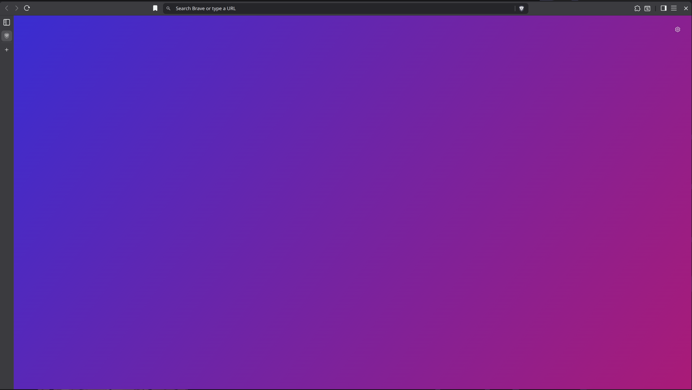

# dotbrave

[](https://github.com/xom11/dotbrave/actions/workflows/ci.yml)
[](https://pypi.org/project/dotbrave/)
[](https://pypi.org/project/dotbrave/)

Manage Brave as a dotfile. Keep keyboard shortcuts, UI tweaks, and
force-installed web apps in a single TOML, apply with one command, sync
across machines — no Brave Sync required.

> **Status: alpha.** Works on Linux, macOS, and Windows against Brave
> stable, beta, and nightly. Extracted from the multi-browser
> [dotbrowser](https://github.com/xom11/dotbrowser) project as a focused,
> Brave-only tool with a flatter CLI (`dotbrave apply` instead of
> `dotbrowser brave apply`). Python 3.11+, standard library only.

## Quick start

The repo ships an opinionated example config: vertical tabs collapsed to
icons, decluttered new tab page, stripped-down toolbar, vim-style hjkl
shortcuts. [`examples/all.toml`](examples/all.toml) bundles all three
namespaces; [`shortcuts.toml`](examples/shortcuts.toml),
[`settings.toml`](examples/settings.toml), and
[`pwa.toml`](examples/pwa.toml) are single-namespace variants.



**Start from what you already have** — export your current
customizations as a ready-to-edit config:

```bash
dotbrave export -o brave.toml
```

**Or apply the example directly from GitHub** — no clone, no install.
Fetched payloads are echoed with byte size + SHA-256 so you can see exactly
what's being applied:

```bash
uvx dotbrave apply --dry-run \
  https://raw.githubusercontent.com/xom11/dotbrave/main/examples/all.toml

# Apply. If Brave is already running, dotbrave uses live apply;
# first-time live setup closes Brave normally and relaunches it once.
uvx dotbrave apply \
  https://raw.githubusercontent.com/xom11/dotbrave/main/examples/all.toml
```

Prefer to inspect / customise locally first? Download then apply:

```bash
curl -fsSL -o brave.toml https://raw.githubusercontent.com/xom11/dotbrave/main/examples/all.toml
# edit brave.toml ...
uvx dotbrave apply brave.toml
```

Anything you later remove from your config reverts to Brave's default on
the next `apply` — no orphan entries.

## Install

```bash
pipx install dotbrave     # global, isolated venv
uvx dotbrave <args>       # run on demand, no install step
pip install dotbrave      # into the active environment
```

Run from a branch: `uvx --from git+https://github.com/xom11/dotbrave dotbrave <args>`.
Local dev: `pip install -e ".[test]"`.

Nix users: the repo ships a flake — `nix run github:xom11/dotbrave`, an
overlay (`overlays.default`), and three modules that split the work by
privilege:

| Output | Manages | Runs as |
|---|---|---|
| `homeManagerModules.default` | `[shortcuts]` + `[settings]` at activation | you |
| `nixosModules.default` | `[pwa]` via `/etc/brave/policies/managed/` | root |
| `darwinModules.default` | `[pwa]` via a managed plist + self-healing LaunchDaemon — **exclusive owner of that plist**, see below | root |

Because the system modules already run as root, `[pwa]` never prompts for
sudo. The home-manager module defaults to `skip = [ "pwa" ]` to match.
Note the asymmetry: `[shortcuts]`/`[settings]` are read at activation
time, but `[pwa]` is read at **evaluation** time — changing the PWA list
needs a rebuild.

**`--impure` is required.** The system modules read `[pwa].urls` with
`builtins.readFile` on an absolute-path string, so evaluation is impure and
`nixos-rebuild`/`darwin-rebuild --flake` (pure by default) will refuse:

```bash
nixos-rebuild  switch --impure --flake ~/.nix#hostname
darwin-rebuild switch --impure --flake ~/.nix#hostname
```

A path literal would evaluate purely but would copy `brave.toml` into the
store and freeze it there, losing the "edit your working tree" property.

**The `[pwa]` table must exist** in a config passed to `services.dotbrave`.
The CLI reads a missing table as "don't manage this namespace", but a module
that writes the *whole* force-list cannot express that — it would install an
empty policy, and Brave uninstalls every PWA not named in the list it is
given. So an absent `[pwa]` is a hard eval error. Write `urls = []` if you
really do mean "uninstall all", or leave `services.dotbrave.enable = false`.

**macOS: the darwin module owns the managed plist outright.** It writes
`/Library/Managed Preferences/com.brave.Browser.plist` from scratch with
`WebAppInstallForceList` as its only key, pins it `schg`, and re-asserts it
every 60 seconds. Any other `com.brave.Browser` policy key already in that
file — homepage, extension forcelist, proxy, anything an MDM profile set — is
dropped and stays dropped. `dotbrave apply` does *not* do this: it reads the
existing payload and merges. The Nix module cannot, because the plist is
runtime state and the file is built at evaluation time. **Do not enable the
darwin module on a Mac whose MDM profile sets other Brave policy keys** — use
`dotbrave apply` there instead.

**macOS: there is no automatic teardown.** Setting
`services.dotbrave.enable = false` removes the LaunchDaemon but leaves the
plist on disk, still immutable, so even `sudo rm` fails. Undo it by hand:

```bash
sudo chflags noschg "/Library/Managed Preferences/com.brave.Browser.plist"
sudo rm "/Library/Managed Preferences/com.brave.Browser.plist"
```

Until you do, Brave keeps enforcing the stale force-list. (`dotbrave apply`
with an empty `[pwa]` table performs the same teardown automatically; the Nix
module has no on-disable hook to hang it on.)

## Build your own config

A single TOML carries `[shortcuts]`, `[settings]` and `[pwa]`. One `apply`
writes all three in a single backup + write cycle.

```toml
# brave.toml
[shortcuts]
toggle_sidebar = ["Control+Shift+KeyE"]
toggle_ai_chat = ["Alt+KeyA"]

# vim-style hjkl
back                = ["Alt+KeyH"]
forward             = ["Alt+KeyL"]
select_previous_tab = ["Alt+KeyJ"]
select_next_tab     = ["Alt+KeyK"]

# Same chord on all OSes — Meta+ = Cmd on macOS, Super on Linux/Windows (auto-translated)
new_tab   = ["Control+KeyT", "Meta+KeyT"]
close_tab = ["Control+KeyW", "Meta+KeyW"]

[settings]
"brave.tabs.vertical_tabs_enabled"   = true
"brave.tabs.vertical_tabs_collapsed" = true
"bookmark_bar.show_on_all_tabs"      = false

[pwa]
# Force-installed Progressive Web Apps. Brave fetches each manifest,
# downloads icons, registers the app in chrome://apps, and emits a
# launcher (.desktop on Linux, app shim on macOS, Start Menu shortcut on
# Windows). Removing a URL + re-applying = uninstall.
urls = [
  "https://squoosh.app/",
  "https://app.element.io/",
]
```

```bash
dotbrave apply brave.toml --dry-run    # preview the diff
dotbrave apply brave.toml              # live apply if Brave is running
```

- **Shortcut keys**: Chromium [KeyEvent codes](https://www.w3.org/TR/uievents-code/)
  joined by `+` — `Control+Shift+KeyP`, `Alt+Digit1`, `F11`. `Meta+` is
  auto-translated to `Command+` on macOS, so one config works everywhere.
- **Setting keys**: dotted paths into the profile `Preferences` JSON.
  MAC-protected keys (`homepage`, default search engine, `pinned_tabs`, …)
  are refused with a clear error — Brave would silently reset them on
  launch. `export` lists protected keys as comments so you know what to
  set in the Brave UI instead.
- **PWA URLs**: every entry installs with
  `default_launch_container = "window"` and `create_desktop_shortcut = true`.
  `[pwa]` is the only namespace that needs elevated privileges: it writes a
  managed-policy file (sudo on Linux/macOS) or the Windows Registry
  (Administrator). No `[pwa]` URL diff → no policy write.
- **Empty header** (e.g. `[settings]` with no entries) wipes everything
  dotbrave previously managed in that namespace. **Missing header** = skip
  the namespace entirely.

## CLI reference

Shape: `dotbrave [profile-flags] <action> [action-flags] [args]`.
Profile flags may be given **before or after** the action name — the
after-action form wins when both are present. `export` is the inverse of
`apply`: produce a round-trippable TOML from the current profile state.

### Profile flags

| Flag | Default | What it does |
|---|---|---|
| `-r, --profile-root PATH` | auto-detected | Brave's root profile directory. |
| `-p, --profile NAME` | `Default` | Profile directory name inside the root — e.g. `"Profile 1"`. |
| `--channel {stable,beta,nightly}` | `stable` | Release channel; auto-detects the `Brave-Browser-Beta` / `-Nightly` profile path and targets the matching process. |

| Channel | Linux | macOS | Windows |
|---|---|---|---|
| stable | `~/.config/BraveSoftware/Brave-Browser` | `~/Library/Application Support/BraveSoftware/Brave-Browser` | `%LOCALAPPDATA%\BraveSoftware\Brave-Browser\User Data` |
| beta / nightly | same, with `-Beta` / `-Nightly` suffix | same, with suffix | same, with suffix |

Snap and Flatpak installs (stable only) are probed automatically on Linux.

```bash
dotbrave apply -r /custom/path -p "Profile 1" brave.toml
dotbrave apply --channel beta brave.toml
```

### Actions

There are exactly two:

| Action | What it does |
|---|---|
| `export [-o FILE] [-a] [--snapshot [--clear]]` | Read your customizations as round-trippable TOML: `[shortcuts]` (bindings that differ from Brave defaults; `-a/--all-shortcuts` lists every binding with its command name), `[settings]` (well-known user-facing keys, keys dotbrave manages, and keys changed since the last `--snapshot` baseline; MAC-protected keys appear as comments), and `[pwa]`. `--snapshot` captures the baseline instead of exporting; `--snapshot --clear` deletes it. |
| `apply [-n] CONFIG \| --undo` | Write `[shortcuts]` + `[settings]` + `[pwa]` from a file or HTTPS URL. `-n/--dry-run` previews the diff. URL fetches print size + SHA-256; pin with `--expect-sha256 HEX`; plain HTTP refused unless `--allow-http`. `--undo` restores the most recent apply-time Preferences backup instead. |

To capture settings you only know how to change in the Brave UI: run
`dotbrave export --snapshot`, change them in Brave, wait a few seconds
(Brave flushes Preferences on a delay), then `dotbrave export` — the
changed keys appear under `[settings]`.

Both actions have detailed `--help` with safety notes and examples.

## How it works

When Brave is closed, `dotbrave` patches the profile `Preferences` JSON
directly, writing atomically (temp file + rename) and verifying the result
by reloading. Any apply that changes `Preferences` takes exactly one
timestamped backup first — a live apply takes it too, before its changes
land, so one `apply --undo` reverts the whole run.

A running Brave is checked for an endpoint three ways before dotbrave
concludes it has none: the port dotbrave itself launched and recorded, the
browser's own `DevToolsActivePort`, and the `--remote-debugging-port` on
the running process's command line. That last one matters more than it
sounds — Brave writes `DevToolsActivePort` only when the port is dynamic
(`--remote-debugging-port=0`), so a browser you started on a fixed port
would otherwise be closed and relaunched for an endpoint it already had.

### macOS: keep a live endpoint from login (optional)

Without a debugging endpoint, the first `dotbrave apply` of each browser
session has to close Brave and relaunch it once just to obtain one. A user
LaunchAgent removes that:

```bash
cp contrib/org.dotbrave.brave-endpoint.plist ~/Library/LaunchAgents/
launchctl bootstrap gui/$UID ~/Library/LaunchAgents/org.dotbrave.brave-endpoint.plist
```

To remove it:

```bash
launchctl bootout gui/$UID/org.dotbrave.brave-endpoint
rm ~/Library/LaunchAgents/org.dotbrave.brave-endpoint.plist
```

Two things to know before installing:

- **Remove Brave from System Settings → General → Login Items.** macOS does
  not allow a second instance of the same app bundle, so whichever launches
  first wins and the other exits immediately. If Brave is already a login
  item, the agent's launch is the one that dies, and you get no endpoint.
- **This starts Brave at login.** The agent does not restart Brave if you
  quit it; a Brave you reopen yourself has no endpoint, and apply falls back
  to closing it once, as before.

The port is dynamic (`=0`) on purpose: Brave writes `DevToolsActivePort`
only for a dynamic port, and that file is how dotbrave finds the endpoint.

When Brave is running, plain `apply` uses Brave's privileged UI APIs over
a private loopback DevTools endpoint: ordinary settings go through
`chrome.settingsPrivate`, New Tab settings through live New Tab UI
actions, and shortcuts through the Settings `CommandsService`. Supported
changes take effect without restarting. A Brave not yet carrying the
endpoint closes normally and relaunches once. The fallback is per key,
not per run: everything with a live route is applied first, and only the
settings Brave does not recognise — plus removals of keys that were never
set before dotbrave managed them, which have no recorded value to write
back — fall back to the same normal-close + verified offline write, which
then names exactly those keys. Dropping a key you had set before dotbrave
touched it applies live like any other change. Any
such relaunch reuses the flags the closed session was running with, so a
Brave started as `brave-browser --ozone-platform=wayland` comes back the
same way. If the relaunch still fails to come up, dotbrave reopens Brave
with its original command line rather than leaving you without a browser
— and when the config was already applied and verified by then, that
relaunch failure is a warning on stderr, not a non-zero exit. A config
whose only diff is `[pwa]` skips the endpoint entirely — the managed
policy is written while Brave keeps running, and Brave loads it at its
next launch. The endpoint binds to `127.0.0.1` only, and there is no
force-kill switch.

`[shortcuts]` and `[settings]` track managed entries in sidecar files
(`Preferences.dotbrave.{shortcuts,settings}.json`), so removing a key from
your config undoes it on the next apply. What it is restored to depends on
the route: an offline removal deletes the key, leaving Brave's compiled
default; a live removal writes back the value the sidecar recorded when
dotbrave first managed that key, which is your own pre-dotbrave value.
`[pwa]` state
lives in Chromium's managed-policy storage (Linux JSON file, macOS plist,
Windows Registry) — the policy *is* the state. `export --snapshot` stores
its baseline in a third sidecar
(`Preferences.dotbrave.settings-snapshot.json`); `apply --undo` leaves it
alone.

On macOS, `/Library/Managed Preferences/` is a system-managed cache that
gets reclaimed at boot on non-MDM machines, which would otherwise
uninstall your PWAs. To keep them installed, `apply` installs a small
root-owned self-healing helper:

- `/Library/LaunchDaemons/org.dotbrave.com.brave.Browser.pwa.plist` —
  watches the managed-preferences directory and rewrites the policy if
  macOS removes it.
- `/Library/Application Support/dotbrave/com.brave.Browser.managed.plist`
  and `com.brave.Browser.heal.sh` — the policy source of truth and the
  rewrite script.

Applying an empty `[pwa]` table (`urls = []`) removes all of the above.

On Linux the policy has a different side effect: it applies to **every**
`--user-data-dir`, and a launcher's file name
(`brave-<app-id>-Default.desktop`) does not include the data dir. So any
Brave started on a throwaway profile — a test harness, a headless
screenshot, an AI agent checking a page — installs the same apps and
overwrites your launchers with its own `--user-data-dir`. From then on
every PWA opens in an empty profile, signed out of everything, with no
error anywhere. `apply` therefore installs a per-user watch (no root):

- `~/.config/systemd/user/dotbrave-pwa-heal.{path,service,timer}` — runs
  the heal whenever `~/.local/share/applications` changes, and once a minute
  as a safety net.
- `~/.local/state/dotbrave/heal-launchers.sh` — restores a hijacked
  launcher from `launchers/`, its last known-good copy. A hijacked launcher
  with no copy is an app id only the throwaway profile has (same URL, but
  its manifest resolved differently there) and is deleted with its icons —
  except on the very first run, when it could be a real app's only launcher
  and just has the `--user-data-dir` stripped. Every fix is logged to
  `heal-launchers.log`.

A machine whose policy already matches still gets the heal on its next
`apply`, without a policy write. `urls = []` removes it.

### Brave install methods

| Install | Auto-detected | `[pwa]` works | Notes |
|---|---|---|---|
| `.deb` / `.rpm` / Arch / NixOS | yes | yes | Reference install; full support. |
| **Snap** | yes | **refused with clear error** — sandbox doesn't read `/etc/brave/policies/managed/` | Use `.deb` for `[pwa]`. |
| **Flatpak** | yes | **refused with clear error** — same sandbox limitation | Relaunch goes back through `flatpak run`. |
| **macOS** `.dmg` | yes | yes | Includes cfprefsd cache invalidation + self-healing daemon. |
| **Windows** installer | yes | yes — writes `HKLM\Software\Policies\BraveSoftware\Brave`; requires Administrator | |

## Coming from dotbrowser?

`dotbrave` is a standalone extraction of dotbrowser's Brave support with
its own state names: sidecars are `Preferences.dotbrave.*.json` (was
`Preferences.dotbrowser.*.json`) and the macOS daemon is
`org.dotbrave.<bundle>.pwa` (was `org.dotbrowser.<bundle>.pwa`). Your
Brave profile itself is untouched by the switch, but entries previously
managed by dotbrowser are not tracked by dotbrave until you `apply` your
config once with dotbrave. On macOS, remove dotbrowser's daemon
(`dotbrowser brave apply` with an empty `[pwa]` table, or the manual
`launchctl bootout` steps in its README) before letting dotbrave manage
`[pwa]`, so two daemons don't fight over the same plist.

## Caveats

- **Brave Sync** can overwrite `[settings]` entries on its next pulse if
  they fall in a synced category. UI-layout keys like
  `brave.tabs.vertical_tabs_*` are local-only and immune. `apply` prints a
  non-fatal warning when `sync.has_setup_completed=true`.
- A handful of settings (`homepage`, default search engine, `pinned_tabs`,
  …) are integrity-protected and refused rather than silently reset by
  Brave on next launch. Set those in the Brave UI.
- **`[pwa]` is force-install** (Chromium's enterprise
  `WebAppInstallForceList`). Apps appear in `chrome://apps` with an
  "Installed by your administrator" label and hidden right-click Remove —
  uninstall by deleting the URL from `[pwa]` and re-applying. That is the
  right semantics for dotfile-style management (the TOML is the source of
  truth), but worth knowing if you also install PWAs by hand.

## License

MIT
